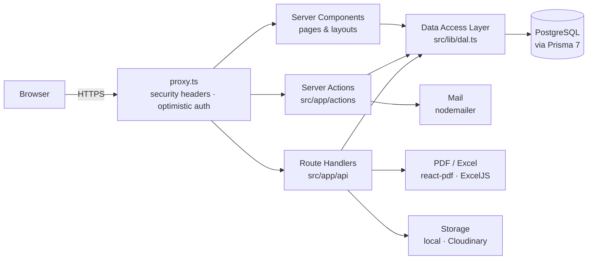
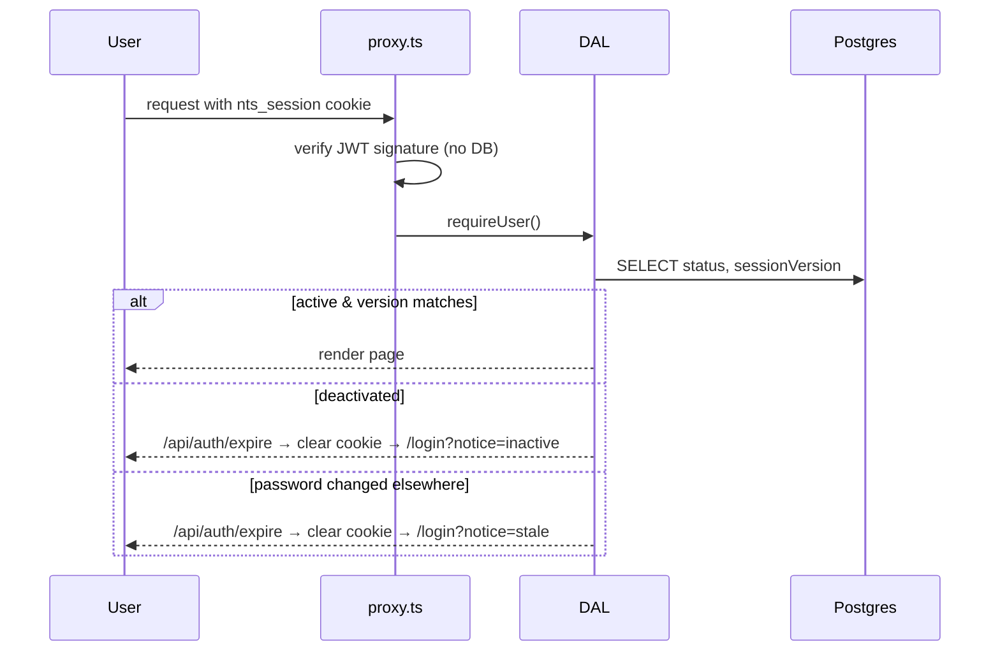
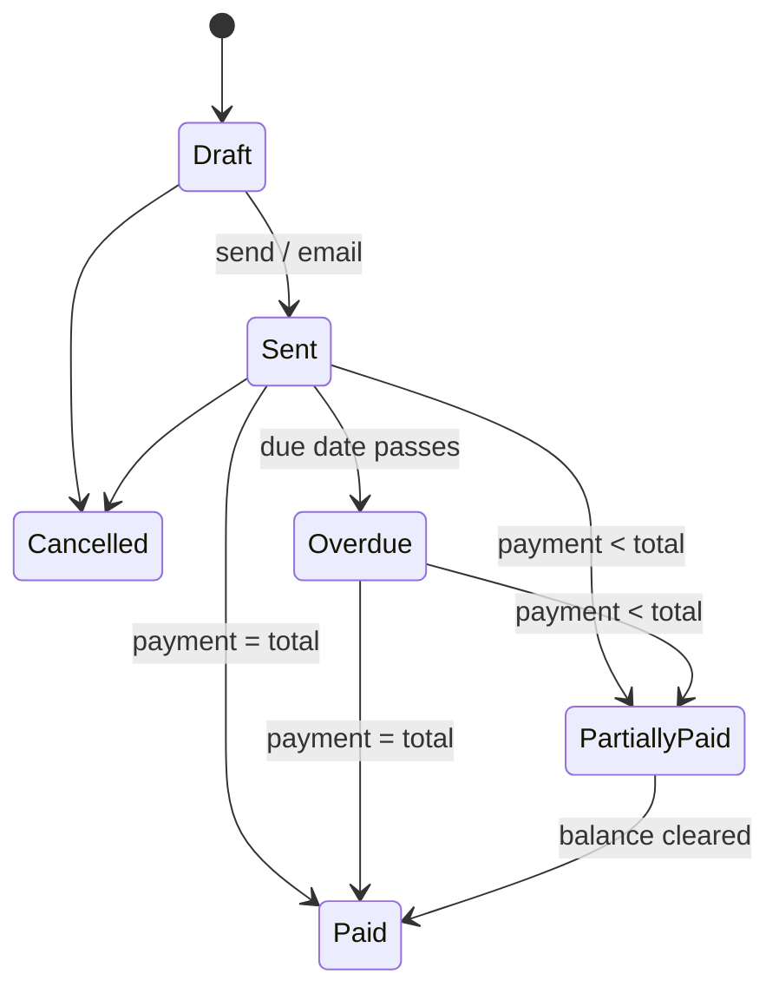
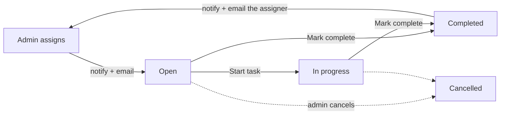

<div align="center">


# NTS Operations & HR Platform

**One place for the business side and the people side of Nutan Tech Solutions —
CNC machine service, retrofitting, automation and robotics, Bengaluru.**

[](https://nextjs.org)
[](https://react.dev)
[](https://www.typescriptlang.org)
[](https://www.prisma.io)
[](https://www.postgresql.org)
[](https://tailwindcss.com)

[Quick start](#-quick-start) ·
[Features](#-what-it-does) ·
[How it works](#-how-it-works) ·
[Commands](#-everyday-commands) ·
[Configuration](#-configuration) ·
[Deploy](#-deployment) ·
[API](docs/API.md)

</div>

---

## ⚡ Quick start

```bash
git clone https://github.com/nishant443/nts-app.git && cd nts-app
npm install
cp .env.example .env        # then set DATABASE_URL and SESSION_SECRET
npm run db:deploy           # create the schema
npm run db:seed             # sample data (optional)
npm run dev                 # → http://localhost:3000
```

<details>
<summary><b>First time on Windows?</b> Three things that trip people up.</summary>

<br>

| Symptom | Fix |
| --- | --- |
| `npm.ps1 cannot be loaded because running scripts is disabled` | `Set-ExecutionPolicy -Scope CurrentUser RemoteSigned` in PowerShell, once. |
| `git` / `gh` not recognised right after installing | Restart VS Code — it snapshots `PATH` at launch. |
| Login page shows a Prisma error | The database is not running. `npm run db:start` for the bundled local Postgres, or check `DATABASE_URL`. |

</details>

<details>
<summary><b>Generate a session secret</b></summary>

<br>

```bash
node -e "console.log(require('crypto').randomBytes(48).toString('base64'))"
```

Paste the output into `SESSION_SECRET` in `.env`. Rotating it later signs everyone out.

</details>

<details>
<summary><b>Sample accounts</b> (from <code>npm run db:seed</code>)</summary>

<br>

| Role | Email | Password |
| --- | --- | --- |
| Administrator | `surjeet@ntss.co.in` | `NtsAdmin@2026` |
| Employee | `shankar@ntss.co.in` | `NtsStaff@2026` |

Change or delete these before any real use. The seed also loads the company
registration details, a dozen machine-tool customers and about three months of
activity, so every screen has something on it.

</details>

---

## ✨ What it does

Two roles, one app. **Employees** see their own work, attendance, leave, expenses
and payslips, plus the customers and documents they raise. **Administrators** see
everything, approve everything, run payroll and hold the company-wide numbers.

<table>
<tr>
<td width="50%" valign="top">

### 💼 Business

| | |
| --- | --- |
| **Customers** | Clients, leads and vendors. GSTIN auto-fills the state, which decides IGST vs CGST/SGST. Add a new customer inline from any dropdown. |
| **Quotations** | Per-line GST slabs, validity, PDF, email, one-click convert to invoice. |
| **Invoices** | GST tax invoice matching the paper format NTS uses — HSN/SAC, PO reference, tax summary, amount in words, bank box with UPI QR. |
| **Payments** | Receipts against invoices or on account; invoice status is always derived from the payments behind it. |
| **Purchase orders** | What NTS buys in, against a vendor record. |
| **Documents** | Certificates, bills and ID proofs filed against a customer or employee. |

</td>
<td width="50%" valign="top">

### 👥 People

| | |
| --- | --- |
| **Tasks** | Admin assigns work → employee is notified in-app **and by email** → marks it complete with a note → admin is told back the same way. |
| **Attendance** | Self check-in from **9:00 am IST**, never on Sundays or holidays. Optional **office geofence** — set the office coordinates and a radius (default 30 m) in Settings → Company and check-in/out only works on site. Times and distance from the office are visible to admins day by day. |
| **Leave** | Requests with balances; approval debits the balance and blocks the calendar. |
| **Daily work** | What each engineer did, per customer, reviewed by an admin. |
| **Expenses** | Claims with receipt upload, approved and folded into the next payslip. |
| **Payroll** | Monthly runs: working days, loss of pay, reimbursements, published payslips. |
| **Employees** | Profiles, salary structures, password resets, **deactivate / reactivate** (nothing is ever deleted). |

</td>
</tr>
</table>

<details>
<summary><b>And across the whole app…</b></summary>

<br>

- **Role-aware dashboards** — the employee dashboard never even queries revenue.
- **Notifications** — in-app bell plus branded email for task events.
- **Global search** — <kbd>Ctrl</kbd>/<kbd>⌘</kbd> + <kbd>K</kbd> across customers, invoices, quotations, employees.
- **Reports** with Excel export; every PDF opens in a new tab.
- **"Saved" confirmation** — one centred pop-up for every successful update, including saves that redirect.
- **Dark mode**, and the whole UI rendered at a comfortable 90% density.
- **Sign-in page** with a live clock and a slideshow of real NTS work (Kellenberger K10, BFW H1250 in Russia).

</details>

---

## 🧭 How it works

### Architecture



### Every request is re-checked

The cookie is only a hint. The DAL re-reads the user on **every** request, so a
deactivated account or a changed password takes effect immediately — not when
the token happens to expire.



### Invoice status is derived, never typed



### Task lifecycle



<details>
<summary><b>Business rules worth knowing</b></summary>

<br>

**GST.** Supply inside Karnataka is CGST + SGST at half the rate each; anywhere
else is IGST at the full rate. Place of supply comes from the customer's state,
derived from their GSTIN. A document-level discount is apportioned across lines
by value so each slab reports the right taxable amount; CGST and SGST are split
after rounding so they always sum to exactly the total tax.

**Document numbers** follow the paper format — `NTS/26-27/28` — where `26-27` is
the Indian financial year (April–March) and the sequence resets each April.
Allocated inside the insert transaction, with a unique constraint and a retry as
backstop.

**Attendance.** Self check-in is accepted only from 9:00 am IST, never on
Sundays or declared holidays (`src/lib/attendance-rules.ts`). The rule runs on
the server *and* drives what the button shows. Times are stored as real instants
and read in Indian Standard Time wherever the app is hosted. Less than four hours
on site becomes a half day.

When an office location is set (Settings → Company → *Attendance location*),
the Check in / Check out buttons first ask the browser for a GPS fix and the
server refuses anything farther than the allowed radius (default 30 m) from the
office. The distance is recorded with every check-in and shown in the admin
day log. Leave the coordinates blank and check-in works from anywhere.

**Payroll.** Working days = calendar days − Sundays − holidays. Paid days =
present (1) + half day (0.5) + approved paid leave. Loss of pay is the shortfall
at `gross ÷ working days`. Approved expenses pass through untouched. A finalized
run is frozen.

**Deactivation.** An employee is never deleted. Deactivating signs them out of
every device, blocks sign-in with the admin's reason (*"Account Deactivated:
reason. Contact Admin."*), and keeps every record; reactivation is one click.
The last active administrator cannot be deactivated, and nobody can deactivate
themselves.

</details>

<details>
<summary><b>Access control — four layers, three load-bearing</b></summary>

<br>

1. **Navigation** hides admin links. Cosmetic.
2. **`src/proxy.ts`** — optimistic cookie check; signed-out visitors are redirected. Not a security boundary.
3. **`src/lib/dal.ts`** — re-reads the user from the database on every request; checks `status` and `sessionVersion`.
4. **Every page, action and endpoint** calls `requireUser()` / `requireAdmin()` (pages) or `requireApiUser()` / `requireApiAdmin()` (API, actions). Role is a *required argument* to `withRoute()` and `formAction()`, so it cannot be forgotten.

Company-wide money is separated, not hidden: `getAdminDashboard()` and
`getEmployeeDashboard()` are different functions, and the employee one never
runs the revenue queries at all.

</details>

---

## 🛠 Everyday commands

| Command | What it does |
| --- | --- |
| `npm run dev` | Development server with Turbopack |
| `npm run verify` | **Typecheck + lint + calculation checks — run before committing** |
| `npm run build` / `npm start` | Production build and serve |
| `npm run db:migrate` | Create and apply a migration (development) |
| `npm run db:deploy` | Apply existing migrations (production) |
| `npm run db:generate` | Regenerate the Prisma client after a schema change — **then restart `dev`** |
| `npm run db:seed` | Load sample data — *clears transactional tables first* |
| `npm run db:studio` | Prisma Studio |
| `npm run db:start` / `db:stop` | Bundled local PostgreSQL on port 5433 (Windows) |
| `npm run check` | Pure-function checks: GST split, loss of pay, amount in words, financial year |

<details>
<summary><b>Importing real data</b></summary>

<br>

| Script | Purpose |
| --- | --- |
| `npx tsx scripts/import-sales.ts` | Rebuilds customers, invoices and payments from the Vyapar sale reports. Wipes existing sales data first; totals are asserted against the reports. |
| `npx tsx scripts/import-real-data.ts` | Loads the operating spreadsheet — work log, tasks, pending payments. Re-runnable. |

</details>

---

## ⚙️ Configuration

All variables are validated once at startup (`src/lib/env.ts`); a bad deployment
fails immediately, not at the first request.

| Variable | Required | Purpose |
| --- | :---: | --- |
| `DATABASE_URL` | ✅ | PostgreSQL connection string. Hosted databases need `?sslmode=require`. Migrations use the direct (non-pooled) host automatically. |
| `SESSION_SECRET` | ✅ | Signs the session JWT. 32+ characters. |
| `NEXT_PUBLIC_APP_URL` | | Absolute URL used in emails. Default `http://localhost:3000`. |
| `STORAGE_DRIVER` | | `local` (default, writes to `./storage`) or `cloudinary`. |
| `CLOUDINARY_CLOUD_NAME` `CLOUDINARY_API_KEY` `CLOUDINARY_API_SECRET` | with cloudinary | All three together. |
| `SMTP_HOST` `SMTP_PORT` `SMTP_SECURE` `SMTP_USER` `SMTP_PASSWORD` `SMTP_FROM` | | Outbound email. Leave `SMTP_HOST` blank and email buttons explain mail is not set up instead of failing. |

<details>
<summary><b>Gmail as the SMTP server</b></summary>

<br>

```env
SMTP_HOST="smtp.gmail.com"
SMTP_PORT="465"
SMTP_SECURE="true"
SMTP_USER="you@gmail.com"
SMTP_PASSWORD="xxxx xxxx xxxx xxxx"   # an App Password, not your login password
SMTP_FROM="Nutan Tech Solutions <you@gmail.com>"
```

</details>

<details>
<summary><b>What changes in the app itself</b></summary>

<br>

After the first sign-in, set the real details under **Settings → Company** —
GSTIN, address, bank details, UPI id (prints a scan-to-pay QR on invoices) and
the home state, which drives every GST calculation. Holidays live under
**Settings → Holidays** and block both check-in and payroll working days.

</details>

---

## 🗂 Project structure

<details open>
<summary><b>Where things live</b></summary>

```
prisma/
  schema.prisma          Data model
  migrations/            Tracked migration history
  seed.ts                Sample data

src/
  app/
    (app)/               Authenticated pages, sharing the app shell
      dashboard/ customers/ quotations/ invoices/ payments/ purchase-orders/
      tasks/ attendance/ leave/ work-logs/ expenses/ payslips/ documents/
      notifications/ reports/ settings/
      admin/             Employees · attendance register · approvals · payroll
    actions/             Server Actions, one file per domain
    api/                 Route handlers — auth, PDFs, exports, search, uploads, files
    login/               Sign-in page, form and photo slideshow

  components/
    ui/                  Design system — button, field, card, table, badge, pop-up…
    layout/              Shell, navigation, search, theme, user menu
    <domain>/            Feature components

  lib/
    dal.ts               Data Access Layer — every authorization decision
    session.ts           JWT encode/decode and cookie handling
    action.ts / api.ts   Server Action and Route Handler wrappers
    validation.ts        Zod schemas for every form and endpoint
    attendance-rules.ts  Check-in window (9 am IST, no Sundays/holidays) + office geofence
    tax.ts               GST computation
    payroll-math.ts      Pure payroll arithmetic
    dates.ts / money.ts  Calendar (IST-aware) and money helpers
    mail.ts              Branded email templates
    pdf/                 Tax invoice, quotation and payslip layouts
    services/            Query aggregation per domain

  proxy.ts               Security headers + optimistic auth redirect
```

</details>

<details>
<summary><b>Conventions to keep</b></summary>

<br>

- **Money** is `Decimal(14,2)` in Postgres. Prisma's `Decimal` cannot cross into a Client Component — map with `toMoney()` first.
- **Calendar days** are stored at UTC midnight; "now" is read in IST via `businessClock()`. Build days with `toDayStart()` / `dayKey()`, never `new Date(...)` directly.
- **List pages take their state from the URL** (`?q=&status=&page=`) and stay Server Components.
- **Client Components import `FormState` from `lib/form-state.ts`**, never from `lib/action.ts` (which drags the server chain into the bundle).
- **Successful saves call `formSuccess()`** (or `flash()` before a `redirect()`); the shared pop-up does the rest.
- After `prisma generate`, **restart the dev server** — the client is a singleton.

</details>

---

## 🔐 Security

<details>
<summary><b>What is in place</b></summary>

<br>

- **Sessions** — HS256 JWT in an `httpOnly`, `SameSite=Lax` cookie, `Secure` in production, 8-hour expiry. Claims: user id, role, session version.
- **Passwords** — bcrypt cost 12. Unknown emails still get a bcrypt comparison so timing does not reveal whether an address exists. The account's status is only revealed *after* the password checks out.
- **Session invalidation** — `sessionVersion` is bumped on password change, admin reset and deactivation; stale cookies are cleared by `/api/auth/expire`.
- **Rate limiting** — login by email *and* IP; writes per account. In-process; swap `hit()` in `src/lib/rate-limit.ts` for Redis before scaling out.
- **Validation** — Zod on the server for every form and endpoint; totals recomputed server-side, never trusted from the browser.
- **Headers** — CSP, `X-Frame-Options: DENY`, `nosniff`, `Referrer-Policy`, `Permissions-Policy`, HSTS in production.
- **Uploads** — magic-byte checks, stored outside `public/`, served through an authenticated route.
- **Audit trail** — every change to money, pay or access is logged with a hashed IP.

</details>

<details>
<summary><b>Before going live</b></summary>

<br>

1. Change or delete the seeded accounts.
2. Set a fresh `SESSION_SECRET`.
3. Switch `STORAGE_DRIVER` to `cloudinary` — local disk is not durable on serverless hosts.
4. Point rate limiting at Redis if running more than one instance.
5. Never commit `.env`.

</details>

---

## 🚀 Deployment

Any Node host works. On **Vercel**:

1. Import the repository.
2. Set the environment variables above.
3. Provision Postgres — Neon, Supabase or Vercel Postgres; append `?sslmode=require`.
4. Build command: `prisma generate && prisma migrate deploy && next build`.
5. `STORAGE_DRIVER=cloudinary` with its three keys.

---

<div align="center">

© Nutan Tech Solutions, Bengaluru · *Precision Restored, Performance Assured.*

</div>
